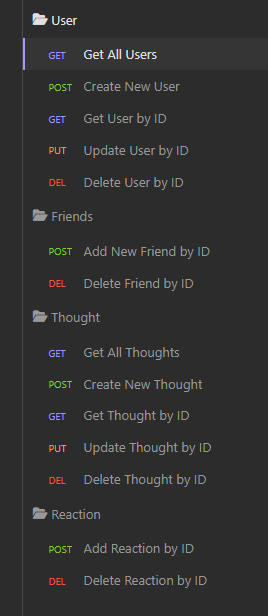
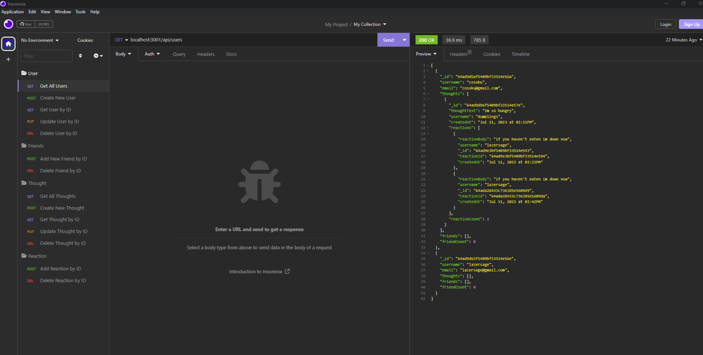

# Social-Network-API

## Description

The purpose of this project is for me to familiar myself with NoSQL Database, MongoDB.

This project uses MongoDB, Mongoose, Express and Luxon. MongoDB is the no SQL database, Mongoose is the Object Data Modeling library for MongoDB, Express is for the server and routes, Luxon is for getter function to format Date/Time

Using the technologies above together thought me the difference between MongoDB and MYSQL.

## Usage

There are many routes included with this social network api.

After creating two users you can add one user to another user's friend's list

Thoughts can be created by users and reactions can be added to Thoughts

Here is what it looks like with some Data in the Database.

Get All Users

GitHub Repo: https://github.com/TimeBytes/Social-Network-API  
Video Walkthrough: https://youtu.be/Jg6iPlaGwUY

## Credits

None

## License

MIT License
